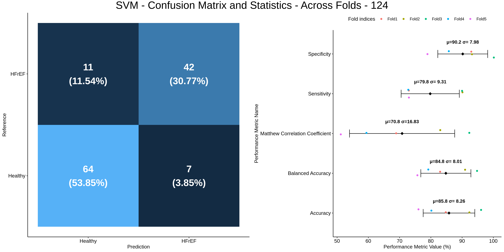
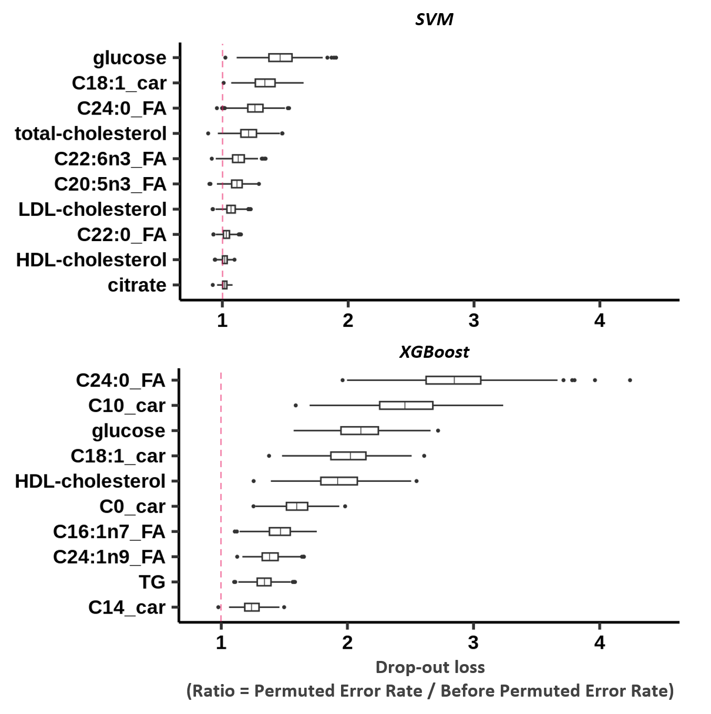
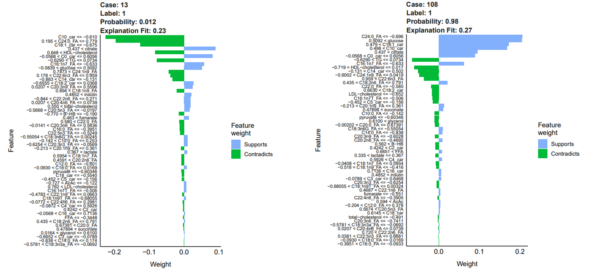
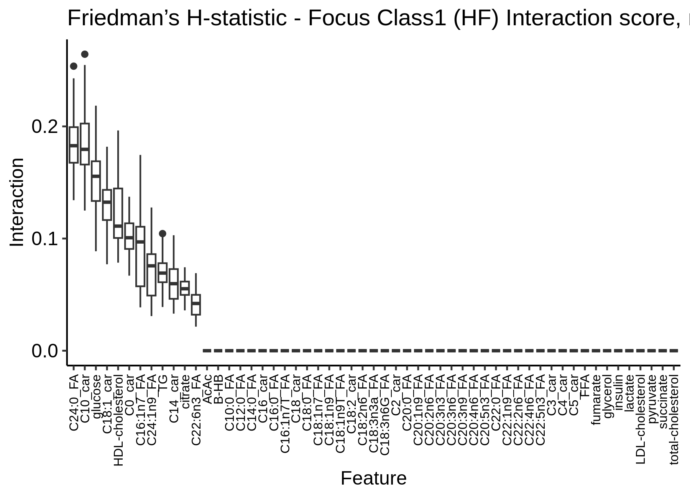

# ML-XAI-HF

This repository contains the code and data related to [this](https://www.sciencedirect.com/science/article/pii/S2001037025000686) paper published in Computational and Structural Biotechnology Journal.

Baron C, Mehanna P, Daneault C, Hausermann L, Busseuil D, Tardif JC, Dupuis J, Des Rosiers C, Ruiz M, Hussin JG. Insights into heart failure metabolite markers through explainable machine learning. Computational and Structural Biotechnology Journal. 2025 Jan 1;27:1012-22.

---

# User-Friendly Tutorial: Explaining Machine Learning Models for Heart Failure Metabolomics

This tutorial guides you through building and interpreting machine learning models using metabolomics data from heart failure (HF) patients. We will:
- Identify key metabolites that distinguish HF patients from healthy controls.
- Uncover interactions among metabolites.

In this document, we focus on Support Vector Machines (SVM) and XGBoost model, both well-suited to capture complex patterns in biological data.

---

## 1. Installing R and Required Tools

Make sure you have **R version 4.1.2** installed on your system. Download and install it from the [CRAN website](https://cran.r-project.org/):

1. Visit the [CRAN download page](https://cran.r-project.org/).
2. Select your operating system (Windows, macOS, or Linux).
3. Download the installer for R version 4.1.2 and follow the installation instructions.

### Installing RStudio (Optional)

RStudio is an integrated development environment (IDE) that makes writing and running R code easier. Download it from [RStudio's website](https://posit.co/download/rstudio/).

---

## 2. Setting Up and Installing Libraries

Open the R console or RStudio and install the required libraries. These packages are essential for data preprocessing, machine learning, and model explainability.

```r
# Install and load required libraries
install.packages(c("xgboost", "tidyverse", "caret", "dplyr", "iml", "DALEX", "lime", "e1071", "ingredients"))

library(xgboost) # Load xgboost for gradient boosting models.
library(tidyverse) # Load tidyverse for data manipulation, visualization, and data wrangling.
library(caret) # Load caret for training models, cross-validation, and hyperparameter tuning.
library(dplyr) Load dplyr for streamlined data manipulation (filtering, selecting, summarizing).
library(iml) # Load iml for interpretable machine learning tools.
library(DALEX) # Load DALEX for model explanation and diagnostics.
library(lime) # Load lime for local, instance-level explanations of model predictions.
library(e1071) # Load e1071 for SVM functions and other statistical learning methods.
library(ingredients) # Load ingredients for computing global feature importance from model explanations.
```

---

## 3. Loading the Dataset

The dataset contains metabolomics data from HF patients and healthy controls. We provided the preprocessed dataset. Each record should include:
- **Sample**: Unique sample identifiers.
- **Label**: Binary classification labels (e.g., `Control` = 0, `HFrEF` = 1).
- **Metabolite columns**: Quantitative levels of various metabolites.

```r
# Load the dataset
# Replace the placeholder with your actual file path
data <- read.csv("## Provide data path here ##")
```

---

## 4. Training an SVM Model

### Objective

We use an SVM with a radial kernel to capture complex, non-linear relationships among metabolites. This approach helps identify key biomarkers and distinguish HF from control samples.

### Steps

1. Prepare the dataset (using cross-validation and excluding non-biological features such as Sample ID and Label).
2. Define hyperparameter grids for tuning.
3. Train the model and evaluate its performance.

```r
# Define seed values for reproducibility and kernel type
seed_values <- c(124, 125, 126)
kernel_type <- "radial"  # Radial basis function kernel

for (seed in seed_values) {
	set.seed(seed)
	
	# Create stratified folds for 5-fold cross-validation
	folds <- createFolds(factor(data$Label), k = 5)
	
	for (fold_index in seq_along(folds)) {
		testing_indices <- folds[[fold_index]]
		
		# Prepare training and testing datasets
		training_data <- data[-testing_indices, ]
		testing_data  <- data[testing_indices, ]
		
		training_labels   <- training_data$Label
		training_features <- training_data[, !names(training_data) %in% c("Sample", "Label")]
		
		# Hyperparameter tuning for SVM
		svm_tune <- tune(
			svm, 
			train.x = training_features, 
			train.y = training_labels,
			kernel = kernel_type, 
			tunecontrol = tune.control(cross = 5), 
			ranges = list(
				cost = seq(7, 9, by = 0.025),
				gamma = seq(0.001, 0.01, by = 0.001)
				#You can also tune nu parameter.
			)
		)
		
		best_cost  <- svm_tune$best.parameters$cost
		best_gamma <- svm_tune$best.parameters$gamma
		
		# Train the SVM model
		svm_model <- svm(
			x = training_features, 
			y = training_labels, 
			type = "nu-classification", 
			kernel = kernel_type, 
			probability = TRUE, 
			gamma = best_gamma, 
			cost = best_cost, 
			scale = FALSE
		)
		
		# Evaluate the SVM model on the test set
		testing_features <- testing_data[, !names(testing_data) %in% c("Sample", "Label")]
		class_model_pred <- predict(svm_model, testing_features)
		
		# Compute confusion matrix
		u <- union(class_model_pred, testing_data$Label)
		t <- table(factor(class_model_pred, u), factor(testing_data$Label, u))
		conf_mat <- confusionMatrix(t, positive = "1", mode = "everything")
	}
}
```

---

## 4b. Training an XGBoost Model

### Objective

In addition to the SVM, we now build an XGBoost model. XGBoost is popular for its performance and scalability, and it can capture non-linear relationships effectively.

### Steps

1. Prepare the dataset similarly to the SVM model.
2. Define the XGBoost parameters.
3. Train the model with early stopping and evaluate its performance.

```r
# Define seed values for reproducibility
seed_values <- c(124, 125, 126)

for (seed in seed_values) {
	set.seed(seed)
	
	# Create stratified folds for 5-fold cross-validation
	folds <- createFolds(factor(data$Label), k = 5)
	
	for (fold_index in seq_along(folds)) {
		testing_indices <- folds[[fold_index]]
		
		# Prepare training and testing datasets
		training_data <- data[-testing_indices, ]
		testing_data  <- data[testing_indices, ]
		
		training_labels   <- as.numeric(training_data$Label)
		training_features <- training_data[, !names(training_data) %in% c("Sample", "Label")]
		
		# Convert data to XGBoost DMatrix format
		dtrain <- xgb.DMatrix(data = as.matrix(training_features), label = training_labels)
		dtest  <- xgb.DMatrix(data = as.matrix(testing_data[, !names(testing_data) %in% c("Sample", "Label")]), 
													label = as.numeric(testing_data$Label))
		
		# Define XGBoost parameters
		params <- list(
			objective = "binary:logistic",
			eval_metric = "logloss",
			max_depth = 6,
			eta = 0.1,
			gamma = 1,
			subsample = 0.8,
			colsample_bytree = 0.8
		)
		
		# Train the XGBoost model with early stopping
		xgb_model <- xgb.train(
			params = params,
			data = dtrain,
			nrounds = 100,
			watchlist = list(train = dtrain, test = dtest),
			verbose = 0,
			early_stopping_rounds = 10
		)
		
		# Generate predictions and evaluate performance
		preds <- predict(xgb_model, as.matrix(testing_data[, !names(testing_data) %in% c("Sample", "Label")]))
		pred_labels <- ifelse(preds > 0.5, 1, 0)
		
		conf_mat <- confusionMatrix(as.factor(pred_labels), as.factor(testing_data$Label), 
																positive = "1", mode = "everything")
		
		print(conf_mat)
	}
}
```
*Example output:*



---

## 5. Global Model Interpretability for SVM and XGBoost

### Purpose

Understanding the global behavior of our SVM model is crucial. Using tools like **DALEX**, we assess:
- Global feature importance.

```r
# Define a custom prediction function for SVM
pred.svm <- function(model, newdata) {
	predict(model, newdata, probability = TRUE)
}

# Explain the SVM model globally using DALEX
explainer_model_svm <- DALEX::explain(
	model = svm_model,
	data = testing_features,
	y = as.vector(as.numeric(as.character(testing_data$Label))),
	predict_function = pred.svm,
	type = "classification",
	label = "SVM"
)

# Explain the SVM model globally using DALEX
explainer_model_xgb <- DALEX::explain(model = model_xgb,
	data = testing_features,
	y = as.vector(as.numeric(as.character(testing_data$Label))),
	predict_function = pred.xgb,
	type="classification",
	label = "XGBoost")

# Compute global feature importance (using permutation)
n_permutations <- 500
vip_svm <- ingredients::feature_importance(
	explainer_model_svm,
	loss_function = DALEX::loss_cross_entropy,
	B = n_permutations,
	type = "ratio"
)

vip_xgb <- ingredients::feature_importance(
	explainer_model_xgb,
	loss_function = DALEX::loss_cross_entropy,
	B = n_permutations,
	type = "ratio"
)

plot(vip_svm,vip_xgb)
```

*Example output:*



---

## 6. Explainability with LIME in the XGB model.

### Purpose

LIME (Local Interpretable Model-agnostic Explanations) helps determine which metabolites most influence individual predictions.

```r
# Create an explainer for the XGB model with LIME
explainer_model <- lime(training_features, xgb_model)

# Explain predictions on the test set
explanation_model <- explain(
	x = testing_data[, !names(testing_data) %in% c("Sample", "Label")],
	explainer = explainer_model,
	n_permutations = 5000,
	dist_fun = "gower",
	kernel_width = NULL,
	n_features = 10,
	feature_select = "auto",
	labels = c("1")
)

# Plot and save LIME explanations
png_filename <- "LIME_Explanation.png"
plot_explanations(explanation_model)
```

*Example output:*



---

## 7. Evaluating Feature Interactions with the H-Friedman Statistics in the XGB model

### Purpose

Friedman interaction statistics assess the strength of interactions between features in the XGB model, offering insight into how pairs of metabolites jointly affect predictions.

```r
# Compute Friedman interaction statistics for the XGB model
ia_results_list <- list()
n_iterations <- 100  # Number of iterations for stability

for (i in 1:n_iterations) {
	mod <- iml::Predictor$new(
		model = svm_model,
		data = testing_features,
		y = testing_data$Label,
		predict.fun = function(model, newdata) predict(model, newdata, probability = TRUE),
		class = "1"
	)
	
	ia <- Interaction$new(mod)
	ia$results$iteration <- i
	ia_results_list[[i]] <- ia$results
}

# Combine results into a single data frame
interaction_df <- bind_rows(ia_results_list)

# Optionally, visualize the interaction statistics
plot(ia)
```

*Example output:*



---

## 8. Conclusion

In this tutorial, we demonstrated a complete workflow for metabolomics analysis using machine learning:
- **SVM Modeling:** Capturing non-linear relationships to classify HFrEF patients versus controls.
- **XGBoost Modeling:** Capturing non-linear relationships to classify HFrEF patients versus controls.
- **Explainability:** Determined global and local model behavior.
- **Interaction Analysis:** Assessing how metabolites interact to influence predictions.

This pipeline bridges the gap between predictive modeling and actionable biological insights, empowering researchers to uncover (potential) novel metabolite biomarkers and understand complex metabolomic patterns.

---
